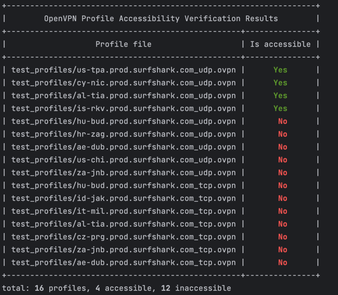

# openvpn-profile-validator
When you have a batch of OpenVPN profile files, but some of them may have connection issues, this program can help you verify them in bulk and quickly identify the available profile files.  
It is usually used for quick verification of manual OpenVPN configuration files provided by Surfshark.

Linux user install openvpn command
```shell
sudo apt-get install openvpn
```
macOS user install openvpn command
```shell
brew install openvpn
```
How to run
```shell
usage: main.py [-h] (-d DIRECTORY | -f FILE) -u USERNAME -p PASSWORD [-t NUM_THREADS]

OpenVPN profile usable validator

optional arguments:
  -h, --help                                    show this help message and exit
  -d DIRECTORY, --directory DIRECTORY           Directory containing OpenVPN profile files
  -f FILE, --file FILE                          Single OpenVPN profile file
  -u USERNAME, --username USERNAME              OpenVPN username
  -p PASSWORD, --password PASSWORD              OpenVPN password
  -t NUM_THREADS, --num_threads NUM_THREADS     Number of threads to use for parallel processing
  --debug                                       Show debug message
  -r, --remove                                  Automatically move invalid OpenVPN profile files to trash folder


```
Sample run
```shell
# validate profiles from directory
python3 main.py -d test_profiles -u OPENVPN_USERNAME -p OPENVPN_PASSWORD -t 10

```
Results sample  


Explanation of the use of username and password:   
Validator will not use your username and password to create an actual VPN connection. The availability of the service is determined by checking whether the 'VERIFY OK' flag appears in the log information, which proves that your network environment can communicate with the server normally.


**Paired coding with GPT 4**

---------------------
### TODO
- [ ] Display the IP address and country of origin of IP address 
- [ ] Display the server response time in the output result
- [ ] Improve the parsing logic of profile files
- [x] Add an option to automatically delete unusable profile files in command line arguments
